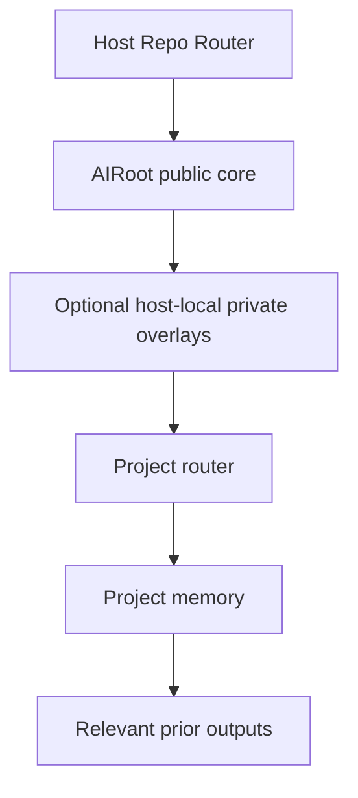

# AIRoot

Public reusable AI operating layer for repo-attached engineering workflows.

`AIRoot` is the part you can publish, reuse, version, and mount into other repositories without carrying project-specific memory, host-private routing, or mutable operational state with it.

## What This Repo Is

Use `AIRoot` when you want a reusable layer for:

- AI protocol modules
- setup and integration guidance
- visual architecture maps
- operational handbooks
- templates and bootstrap scripts
- design and roadmap documents

The public execution core in this repo is [`xuunity`](./Modules/XUUnity/), a Unity-focused protocol family for engineering, review, SDK work, product-facing implementation questions, and protocol maintenance.

## What This Repo Is Not

`AIRoot` is not the runtime source of truth for a real production host repo.

In an attached host, the source of truth typically lives in:

- a repo router such as `Agents.md`
- host-local private modules or overlays when needed
- project routers
- project memory under `Assets/AIOutput/ProjectMemory/`
- project outputs under `Assets/AIOutput/`
- repo-level mutable AI state under `AIOutput/`

Practical rule:
- `AIRoot` defines reusable public-safe building blocks
- the host repo decides how those blocks are actually routed at runtime

## First Mental Model

Think in three layers:

1. `AIRoot/`
   Public reusable layer.
2. Host repo routing and mutable state
   Repo router, host-local overlays, setup wrappers, reports, registry.
3. Project-local truth
   Project routers, project memory, and project outputs.



The important boundary is simple:
- reusable and public-safe -> keep it in `AIRoot`
- host-private or mutable -> keep it outside `AIRoot`
- project-specific durable truth -> keep it in project-local memory

## Start Here

If you are new to this repo, use this reading order:

1. [Operations/AI_PROTOCOL_HANDBOOK.md](./Operations/AI_PROTOCOL_HANDBOOK.md)
2. [Visuals/AI_PROTOCOL_VISUAL_MAP.md](./Visuals/AI_PROTOCOL_VISUAL_MAP.md)
3. [Operations/SETUP_INDEX.md](./Operations/SETUP_INDEX.md)
4. [INTEGRATION.md](./INTEGRATION.md)

If you want the shortest possible path:

- understand the protocol surface: [AI_PROTOCOL_HANDBOOK.md](./Operations/AI_PROTOCOL_HANDBOOK.md)
- understand the architecture: [AI_PROTOCOL_VISUAL_MAP.md](./Visuals/AI_PROTOCOL_VISUAL_MAP.md)
- attach it to a real repo: [INTEGRATION.md](./INTEGRATION.md)

## What You Get

### Public Protocol Core

- [`Modules/XUUnity/`](./Modules/XUUnity/)
  Public-safe execution protocol for Unity mobile engineering.

Inside `xuunity` you get:
- roles
- tasks
- reviews
- utilities
- skills
- platforms
- decision-support knowledge

### Reusable Operations

- [`Operations/`](./Operations/)
  Setup guides, handbooks, exporter workflows, and generic operational docs.

Main entrypoints:
- [AI_SETUP.md](./Operations/AI_SETUP.md)
- [SETUP_INDEX.md](./Operations/SETUP_INDEX.md)
- [AI_PROTOCOL_HANDBOOK.md](./Operations/AI_PROTOCOL_HANDBOOK.md)

### Visuals And Design

- [`Visuals/`](./Visuals/)
  Architecture and protocol maps.
- [`Design/`](./Design/)
  Long-form design notes and system documents.
- [`Roadmaps/`](./Roadmaps/)
  Execution plans, roadmap state, and milestone-level direction.

### Templates And Scripts

- [`Templates/`](./Templates/)
  Reusable templates for routers, reviews, and operational workflows.
- [`scripts/`](./scripts/)
  Bootstrap helpers for attaching `AIRoot` to a host repo.

Main bootstrap entrypoints:
- `AIRoot/AIROOT_SETUP.md`
- `AIRoot/Operations/AIROOT_SETUP_PROTOCOL.md`
- `AIRoot/scripts/init_ai_topology.sh`
- `AIRoot/scripts/init_ai_repo.sh`
- `AIRoot/scripts/init_ai_project.sh`

## Repository Map

- `Modules/`
  Public execution protocols and reusable prompt behavior.
- `Operations/`
  Generic setup, onboarding, export, and handbook docs.
- `Visuals/`
  Architecture maps and diagrams.
- `Design/`
  Protocol and system design documents.
- `Roadmaps/`
  Planning and execution direction.
- `Templates/`
  Reusable templates for adoption and maintenance.
- `scripts/`
  Bootstrap tooling for repo and project setup.

## How `xuunity` Fits

[`xuunity`](./Modules/XUUnity/) is the main public protocol family in `AIRoot`.

Use it for:
- bug fixing
- refactoring
- feature development
- code review
- SDK integration and SDK review
- native plugin work
- performance and runtime stability
- product-facing implementation explanations
- protocol-system maintenance

Canonical public entrypoints:
- module overview: [Modules/XUUnity/README.md](./Modules/XUUnity/README.md)
- command handbook: [Operations/AI_PROTOCOL_HANDBOOK.md](./Operations/AI_PROTOCOL_HANDBOOK.md)
- visual map: [Visuals/AI_PROTOCOL_VISUAL_MAP.md](./Visuals/AI_PROTOCOL_VISUAL_MAP.md)

## Integration Model

Attach `AIRoot` to a real host repo and let the host own runtime routing.

Recommended host shape:

```text
HostRepo/
  Agents.md
  AIRoot/
  AIOutput/
  ProjectA/
    Agents.md
    Assets/
      AIOutput/
        ProjectMemory/
```

Use:
- [INTEGRATION.md](./INTEGRATION.md) for the host contract
- [SETUP_INDEX.md](./Operations/SETUP_INDEX.md) for setup entrypoints

Do not:
- add `AIRoot/Agents.md`
- create fake project memory under `AIRoot`
- treat `AIRoot` as a replacement for a host repo router

## Placement Rules

Use `AIRoot` for:
- reusable public-safe protocol behavior
- reusable setup and onboarding docs
- reusable templates
- public-safe diagrams and design notes

Do not use `AIRoot` for:
- host-private protocol families
- host-level mutable state
- project-specific memory
- project-specific generated outputs
- the only source of truth for active runtime behavior

## Main Documents

- design:
  - [XUUNITY_SKILLS_SYSTEM_DESIGN.md](./Design/XUUNITY_SKILLS_SYSTEM_DESIGN.md)
  - [XUUNITY_PRODUCT_PROTOCOLS_DESIGN.md](./Design/XUUNITY_PRODUCT_PROTOCOLS_DESIGN.md)
  - [XUUNITY_UPSTREAM_SUBMODULE_DESIGN.md](./Design/XUUNITY_UPSTREAM_SUBMODULE_DESIGN.md)
  - [XUUNITY_EXTERNAL_REPOS_DESIGN.md](./Design/XUUNITY_EXTERNAL_REPOS_DESIGN.md)
- roadmap:
  - [AI_AUTOMATION_ROADMAP.md](./Roadmaps/AI_AUTOMATION_ROADMAP.md)
  - [AI_AUTOMATION_EXECUTION_PLAN.md](./Roadmaps/AI_AUTOMATION_EXECUTION_PLAN.md)
- visuals:
  - [AI_PROTOCOL_VISUAL_MAP.md](./Visuals/AI_PROTOCOL_VISUAL_MAP.md)
- operations:
  - [AI_PROTOCOL_HANDBOOK.md](./Operations/AI_PROTOCOL_HANDBOOK.md)
  - [AI_SETUP.md](./Operations/AI_SETUP.md)
  - [SETUP_INDEX.md](./Operations/SETUP_INDEX.md)
  - [AI_PRODUCT_OWNER_SETUP.md](./Operations/AI_PRODUCT_OWNER_SETUP.md)
  - [AI_PRODUCT_OWNER_QUICKSTART.md](./Operations/AI_PRODUCT_OWNER_QUICKSTART.md)
  - [AI_EXTERNAL_REPO_PATH_MIGRATION_RUNBOOK.md](./Operations/AI_EXTERNAL_REPO_PATH_MIGRATION_RUNBOOK.md)
  - [XUUNITY_KNOWLEDGE_EXTRACTION_EVALUATION.md](./Operations/XUUNITY_KNOWLEDGE_EXTRACTION_EVALUATION.md)
- integration:
  - [INTEGRATION.md](./INTEGRATION.md)

## Fast Start

If you are evaluating this repo for adoption:

1. Read [AI_PROTOCOL_HANDBOOK.md](./Operations/AI_PROTOCOL_HANDBOOK.md)
2. Read [AI_PROTOCOL_VISUAL_MAP.md](./Visuals/AI_PROTOCOL_VISUAL_MAP.md)
3. Read [INTEGRATION.md](./INTEGRATION.md)
4. Use [SETUP_INDEX.md](./Operations/SETUP_INDEX.md) to bootstrap a host repo
