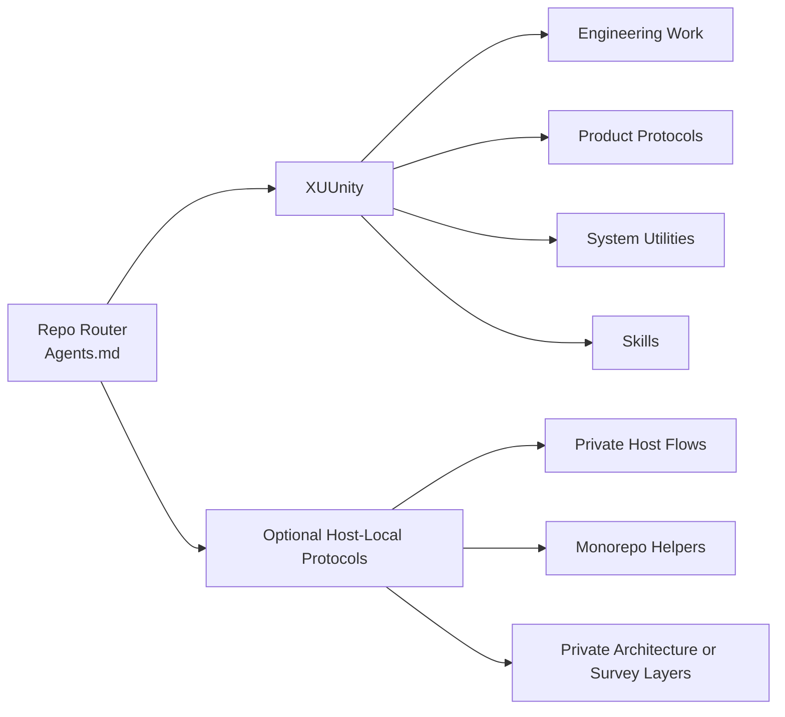
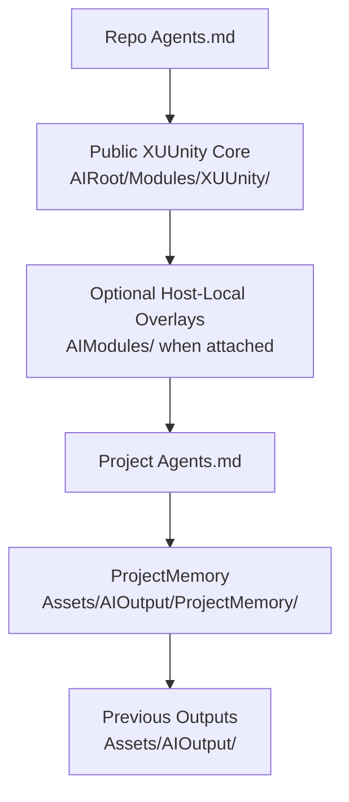
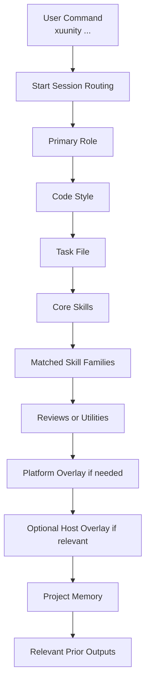
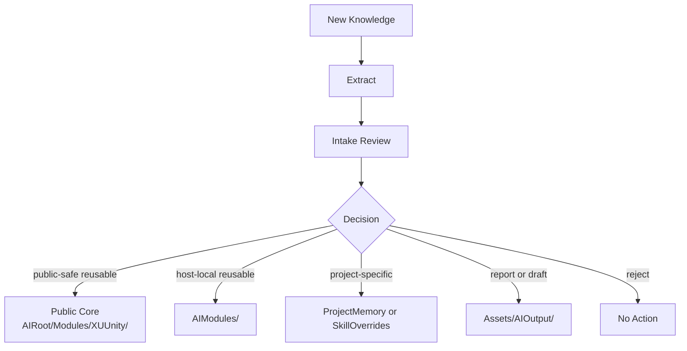
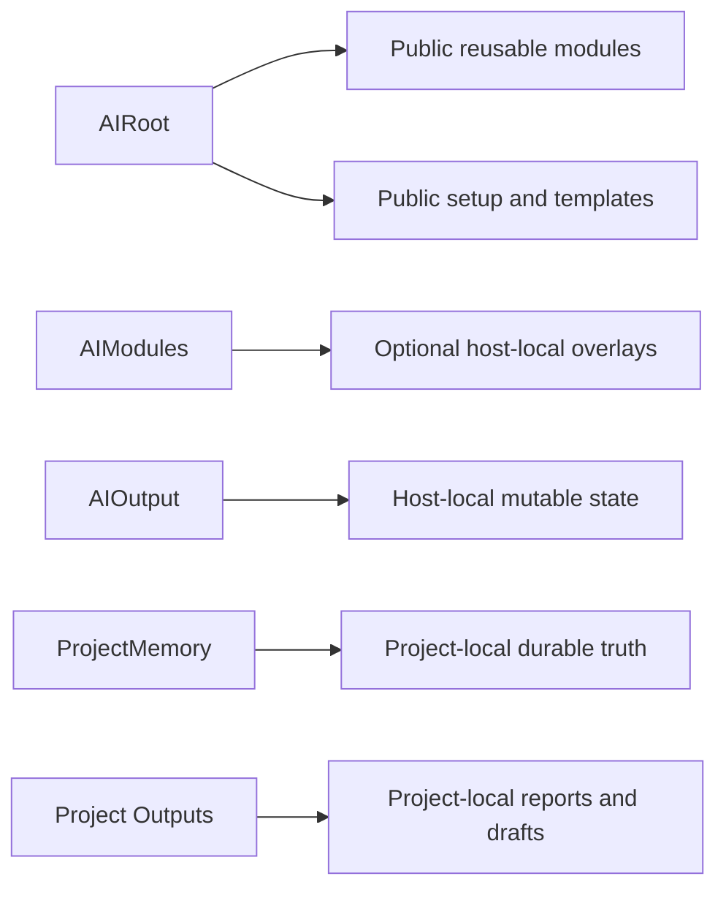

# AI Protocol Visual Map

## Purpose
This file gives a generic visual overview of the public `AIRoot` protocol model.

It focuses on:
- the public `xuunity` core
- optional host-local overlays
- project-local memory and outputs

It is a navigation aid, not the source of truth.

## 1. Protocol Families

## 2. Load Order

## 3. XUUnity Main Stack

## 4. Knowledge Flow

## 5. Storage Boundaries

## 6. Quick Routing Guide

| Need | Route |
| --- | --- |
| Fix or refactor code | `xuunity ...` |
| Review SDK or native integration | `xuunity sdk ...` or `xuunity native ...` |
| Ask product-facing implementation question | `xuunity product ...` |
| Audit project readiness | `xuunity product health ...` |
| Check project-memory freshness | `xuunity project memory freshness ...` |
| Extract reusable knowledge | `xuunity extract knowledge` |
| Convert a long chat into reusable engineering context | `xuunity system extract review artifact from this chat` |
| Use private host-local flows | host-specific protocol selected by the host router |

## 7. Main Rule

Public `AIRoot` documents:
- `xuunity`
- generic optional host-local overlays

Private host-only protocol families should be documented only in host-local routers and host-local docs.
