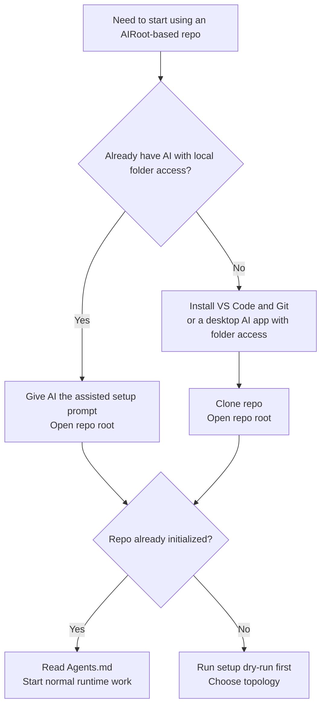
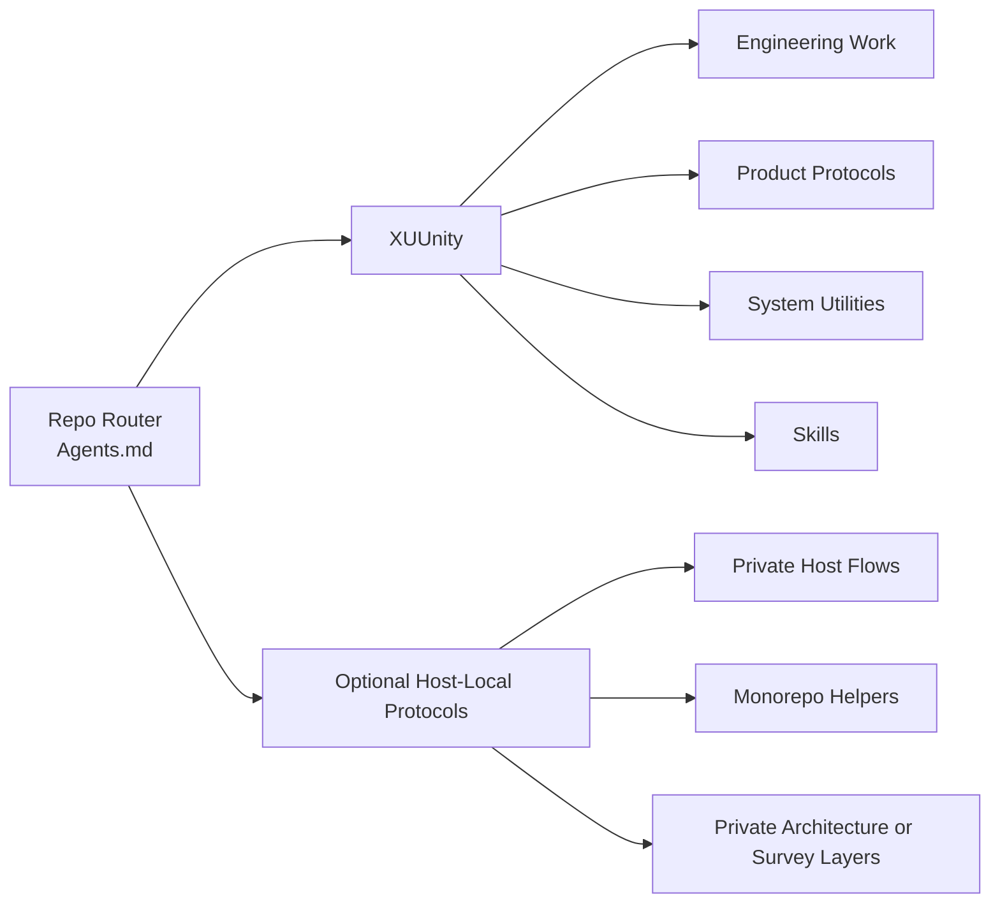
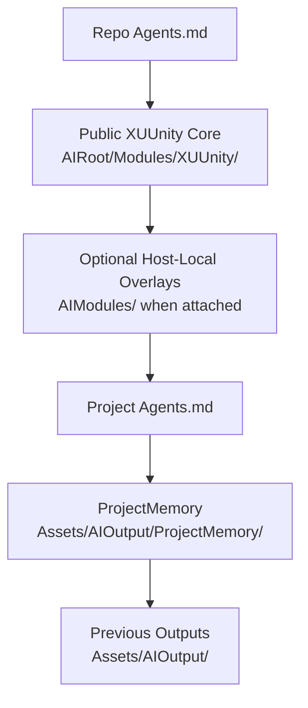
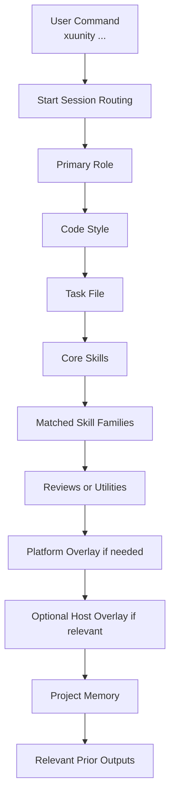
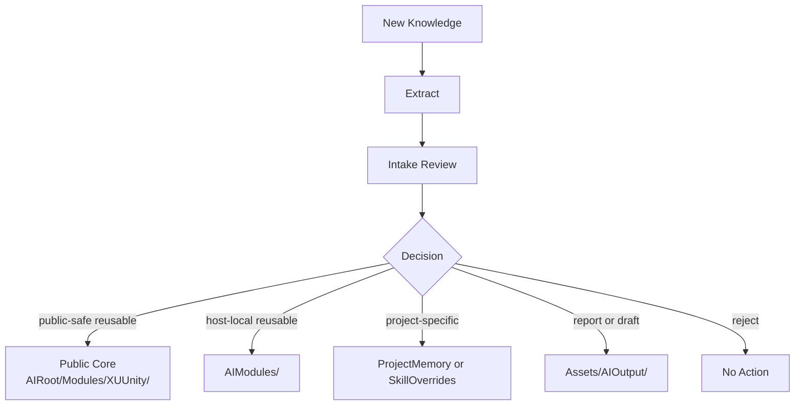
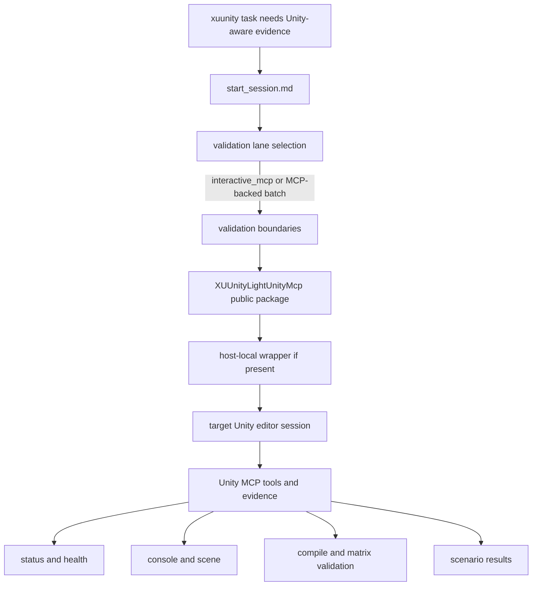
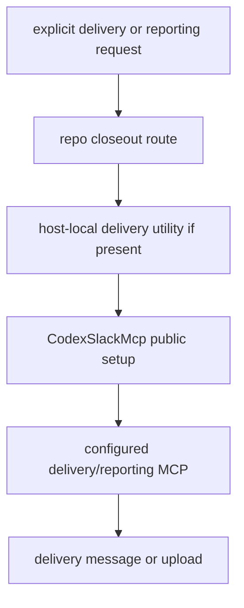
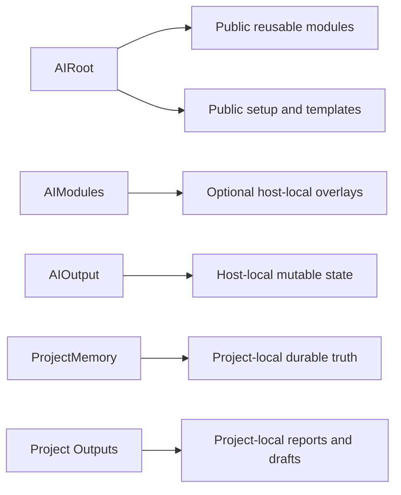

# AI Protocol Visual Map

## Purpose
This file gives a generic visual overview of the public `AIRoot` protocol model.

It focuses on:
- the public `xuunity` core
- optional host-local overlays
- project-local memory and outputs
- public MCP surfaces for validation and delivery/reporting

It is a navigation aid, not the source of truth.

Suggested public reading order:
1. `../Operations/AI_EASY_SETUP.md` when you need the simplest first-use setup path
2. `../Operations/AI_PROTOCOL_HANDBOOK.md` for operator rules and command guidance
3. this visual map for topology and layer relationships
4. `AIRoot/Operations/XUUnityLightUnityMcp/README.md` or `AIRoot/Operations/CodexSlackMcp/README.md` when you need the concrete MCP package surface

## 0. Simple Start Paths

```mermaid
flowchart TD
    A[Need to start using an AIRoot-based repo] --> B{Already have AI with local folder access?}
    B -->|Yes| C[Give AI the assisted setup prompt<br/>Open repo root]
    B -->|No| D[Install VS Code and Git<br/>or a desktop AI app with folder access]
    C --> E{Repo already initialized?}
    D --> F[Clone repo<br/>Open repo root]
    F --> E
    E -->|Yes| G[Read Agents.md<br/>Start normal runtime work]
    E -->|No| H[Run setup dry-run first<br/>Choose topology]
```

## 1. Protocol Families

```mermaid
flowchart LR
    A[Repo Router<br/>Agents.md] --> B[XUUnity]
    A --> C[Optional Host-Local Protocols]

    B --> B1[Engineering Work]
    B --> B2[Product Protocols]
    B --> B3[System Utilities]
    B --> B4[Skills]

    C --> C1[Private Host Flows]
    C --> C2[Monorepo Helpers]
    C --> C3[Private Architecture or Survey Layers]
```

## 2. Load Order

```mermaid
flowchart TD
    A[Repo Agents.md] --> B[Public XUUnity Core<br/>AIRoot/Modules/XUUnity/]
    B --> C[Optional Host-Local Overlays<br/>AIModules/ when attached]
    C --> D[Project Agents.md]
    D --> E[ProjectMemory<br/>Assets/AIOutput/ProjectMemory/]
    E --> F[Previous Outputs<br/>Assets/AIOutput/]
```

## 3. XUUnity Main Stack

```mermaid
flowchart TD
    A[User Command<br/>xuunity ...] --> B[Start Session Routing]
    B --> C[Primary Role]
    C --> D[Code Style]
    D --> E[Task File]
    E --> F[Core Skills]
    F --> G[Matched Skill Families]
    G --> H[Reviews or Utilities]
    H --> I[Platform Overlay if needed]
    I --> J[Optional Host Overlay if relevant]
    J --> K[Project Memory]
    K --> L[Relevant Prior Outputs]
```

## 4. Knowledge Flow

```mermaid
flowchart TD
    A[New Knowledge] --> B[Extract]
    B --> C[Intake Review]
    C --> D{Decision}
    D -->|public-safe reusable| E[Public Core<br/>AIRoot/Modules/XUUnity/]
    D -->|host-local reusable| F[AIModules/]
    D -->|project-specific| G[ProjectMemory or SkillOverrides]
    D -->|report or draft| H[Assets/AIOutput/]
    D -->|reject| I[No Action]
```

## 5. MCP Surfaces

Treat MCP as two different operational surfaces:
- Unity-aware validation and editor evidence
- delivery/reporting integrations such as Slack

Do not collapse them into one generic "MCP setup" concept.

### Unity MCP

Shared source of truth:
- `AIRoot/Modules/XUUnity/tasks/start_session.md`
- `AIRoot/Modules/XUUnity/knowledge/unity_validation_boundaries.md`
- `AIRoot/Modules/XUUnity/knowledge/validation_lanes.md`

Shared operational package:
- `AIRoot/Operations/XUUnityLightUnityMcp/README.md`

Supporting public docs:
- `AIRoot/Operations/XUUnityLightUnityMcp/BUILD_AUTOMATION.md`
- `AIRoot/Operations/XUUnityLightUnityMcp/AI_INTEGRATION.md`
- `AIRoot/Operations/XUUnityLightUnityMcp/SMOKE_TESTS.md`

### Delivery / Reporting MCP

Shared public-safe setup:
- `AIRoot/Operations/CodexSlackMcp/README.md`
- `AIRoot/Operations/CodexSlackMcp/init_codex_slack_mcp.sh`
- `AIRoot/Templates/CodexSlackMcp/README.md`

Operator guidance for these MCP surfaces lives in:
- `AIRoot/Operations/AI_PROTOCOL_HANDBOOK.md` -> `MCP Surfaces`
- `AIRoot/Operations/AI_PROTOCOL_HANDBOOK.md` -> `Validation Lane Selection`
- `AIRoot/Operations/AI_PROTOCOL_HANDBOOK.md` -> `Delivery Reporting`

## 6. Unity MCP Validation Topology

```mermaid
flowchart TD
    A[xuunity task needs Unity-aware evidence] --> B[start_session.md]
    B --> C[validation lane selection]
    C -->|interactive_mcp or MCP-backed batch| D[validation boundaries]
    D --> E[XUUnityLightUnityMcp public package]
    E --> F[host-local wrapper if present]
    F --> G[target Unity editor session]
    G --> H[Unity MCP tools and evidence]

    H --> H1[status and health]
    H --> H2[console and scene]
    H --> H3[compile and matrix validation]
    H --> H4[scenario results]
```

Working rule:
- if the active host or project exposes a supported Unity MCP path, prefer that path for Unity-aware validation
- do not treat shell compile, generated project builds, or ad hoc shell scripts as equivalent to Unity MCP evidence

## 7. Delivery / Reporting MCP Topology

```mermaid
flowchart TD
    A[explicit delivery or reporting request] --> B[repo closeout route]
    B --> C[host-local delivery utility if present]
    C --> D[CodexSlackMcp public setup]
    D --> E[configured delivery/reporting MCP]
    E --> F[delivery message or upload]
```

Working rule:
- delivery/reporting MCPs are secondary output surfaces
- they must not replace the actual system of record

## 8. Storage Boundaries

```mermaid
flowchart LR
    A[AIRoot] --> A1[Public reusable modules]
    A --> A2[Public setup and templates]
    B[AIModules] --> B1[Optional host-local overlays]
    C[AIOutput] --> C1[Host-local mutable state]
    D[ProjectMemory] --> D1[Project-local durable truth]
    E[Project Outputs] --> E1[Project-local reports and drafts]
```

## 9. Quick Routing Guide

| Need | Route |
| --- | --- |
| Fix or refactor code | `xuunity ...` |
| Review SDK or native integration | `xuunity sdk ...` or `xuunity native ...` |
| Ask product-facing implementation question | `xuunity product ...` |
| Audit project readiness | `xuunity product health ...` |
| Check project-memory freshness | `xuunity project memory freshness ...` |
| Need Unity-aware validation evidence | `xuunity ...` plus the host's Unity MCP lane when available |
| Need delivery/reporting closeout | host-local delivery/reporting MCP route when the host provides one |
| Need the simplest first-use setup path | `AIRoot/Operations/AI_EASY_SETUP.md` |
| Extract reusable knowledge | `xuunity extract knowledge` |
| Convert a long chat into reusable engineering context | `xuunity system extract review artifact from this chat` |
| Use private host-local flows | host-specific protocol selected by the host router |

## 10. Main Rule

Public `AIRoot` documents:
- `xuunity`
- generic optional host-local overlays
- public MCP packages and public MCP setup that are reusable across hosts

Private host-only protocol families should be documented only in host-local routers and host-local docs.
